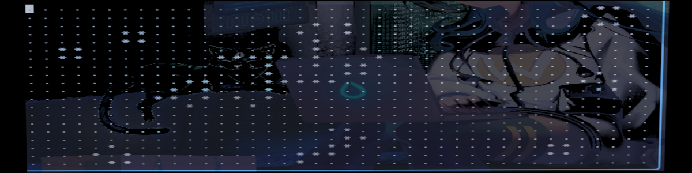

# Table of Contents


<details> <summary>Tap to View</summary>
- <a href="#rocket-installation-quick-start"> Quick Start </a>
- <a href="#books-usage-example"> Usage Example </a>
</details>


# :rocket: (Installation) Quick Start

## For :zzz: Lazy.nvim

```lua
{
    'StealthSoldierM/conways-gol.nvim',
    config = function()
        vim.keymap.set('n', '<leader>cg', ':Conway<CR>', { desc = 'Play conways Game of Life'})
    end,
    lazy = false,
}
```


## With Native Package Manager

In **neovim's** command mode


```lua
:lua=vim.pack.add('Game of Life', 'git@github.com/StealthSoldierM/conways-gol.nvim')
```


## :books: Usage Example
ther are Two Ways to Start the  Game


1. Using **neovim's** command mode
```console
$ :Conway
```

2. Using Key Bindings
To start/stop **Conways - Game of Life** type below keys in *neovim* on ~~Normal Mode~~.

```
<leader>cg -> Init+Start the Game
q -> To Quit The Game
p -> Toogle Play and pause State
```


# Uninstallation Guide

## :zzz: Lazy.nvim


In **neovim's** command mode

```lua
:Lazy
```

Then from **UI select and press** `x` from keyboard.


## With Native Package Manager

In **neovim's** command mode


```lua
:lua=vim.pack.remove('Game of Life')
```

# :sparkles: Summary
Just enjoy. Credit to <a href='https://en.wikipedia.org/wiki/Conway%27s_Game_of_Life'> THIS </a> article.
